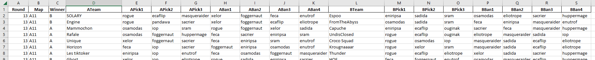

Web Scraper using Python with Helium to:

-   get all matches data of a Dofus KTA tournament
-   generate a excel file.

Result:

## Todo

-   [ ] Performance
-   [ ] reduce sleeps
-   [ ] Progress Bar Terminal ?
